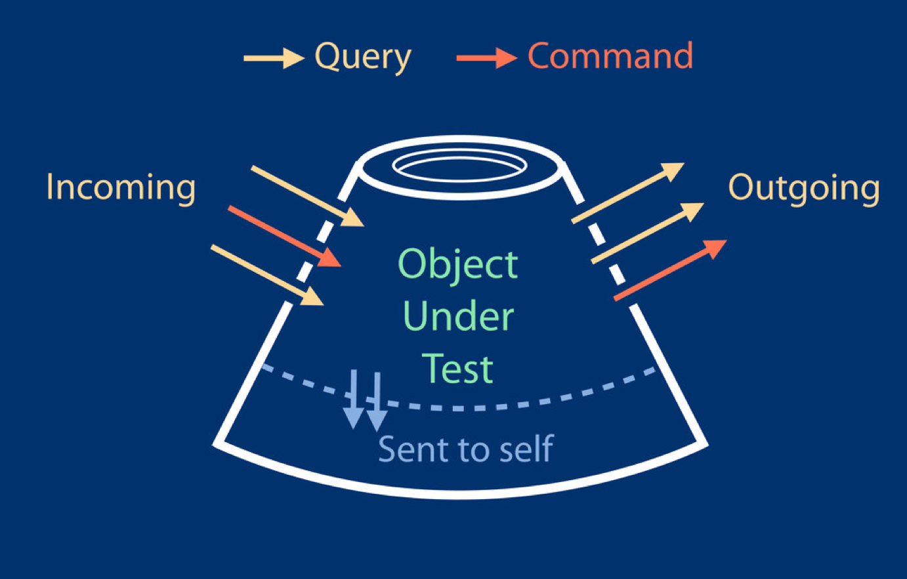
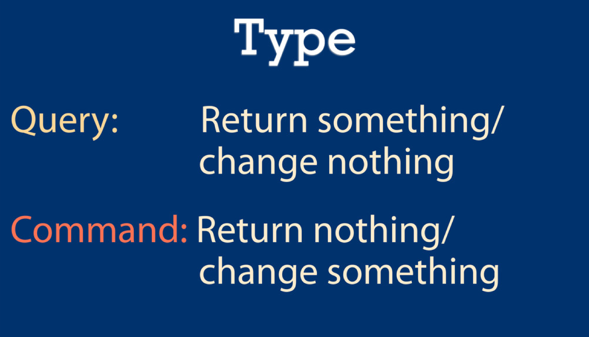
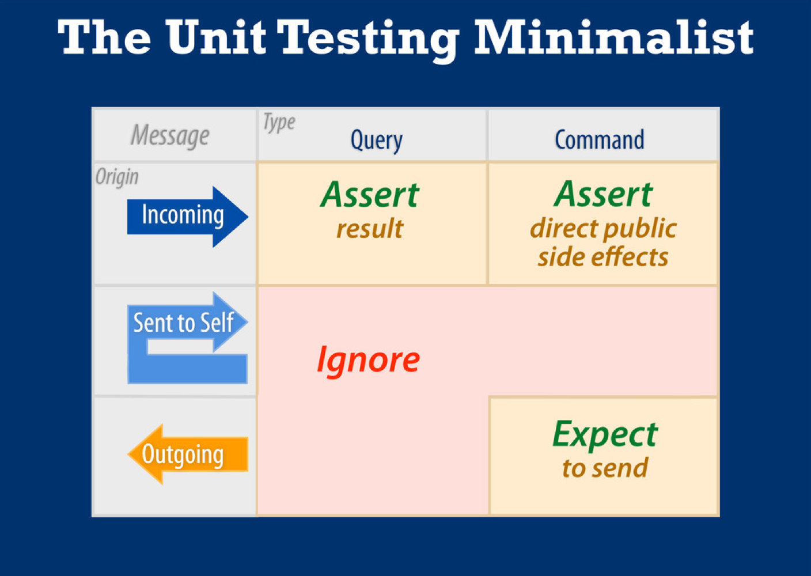

# Sandi Metz
## <i><cite>Practical Object-Oriented Design in Ruby</cite></i>

[Code examples](https://github.com/skmetz/poodr)

Also, see: ["The Magic Tricks of Testing", *Rails Conf 2013*](https://www.youtube.com/watch?v=URSWYvyc42M)

-----

#### Acknowledge Dependencies

pp. 53 - 55

Remove all unnecessary dependencies; objects should depend on more stable objects.

<caption>Likelihood of change versus number of dependents</caption>

| | | |
|:--:|:--:|:--:|
| *Many* | <u>Abstract Zone</u>: Changes are unlikely but, if they occur, will have broad effects. | <u>Danger Zone</u>: These classes <em>WILL</em> change and the changes will cascade into dependents. |
| *Few*  | <u>Neutral Zone</u>: Changes are unlikely and have few side effects. | <u>Neutral Zone</u>: Changes are likely but they have few side effects. |
|        | *Less* | *More* |

------

p. 65

Learn and use sequence <abbr>UML</abbr> diagrams

------

#### The Law of Demeter

pp. 80 - 83

* "restricts the set of objects to which a method may <em>send</em> messages"
* loose coupling; "only talk to your immediate neighbors"
* OK to chain messages if the types are the same
* delegate.rb and forwardable.rb can intercept messages sent to *self*, but are easily abused to simply hide tight coupling.
* Ask: "What does X want from Y?" Then use that answer to help decide on what your public interface should look like. -> Naturally builds trust among objects.

------

#### Duck Typing Basics

pp. 90 - 104

* What they do, not who they are -- virtual types
* Ask: are a method's arguments actually related to the underlying class?
* Abstractions are easier to extend but more obscure.
* Polymorphism: senders don't care about the class of the receiver; objects of various classes may respond to the message. Literally, "many forms".
* Recognizing Hidden Ducks:
  * Case statements that switch on class
  * `kind_of?` and `is_a?`
  * `responds_to?`
* "Good tests are the best documentation"
* Statically typed languages can't save you

------

#### Classical Inheritance

pp. 116 - 139

* "Subclasses are *specializations* of their superclasses.*
* "Ease of extension is inheritance's greatest strength"
* The superclass is abstract. It wouldn't make sense to send it a message.
* Planning is hard. Write your concrete classes first, then refactor into an abstract class.
* Rule of thumb: Wait until you have at least three concrete classes to refactor with an abstract class.
* Both the abstract and concrete classes can set default state; instances of subclasses can ignore defaults.
* **Template Method Pattern** - define a basic structure in the superclass and send messages to acquire subclass-specific contributions
  * Write useful error messages
  * Subclasses shouldn't have to know about their abstract class
    * "Any programmer can forget to send `super`"
    * Decouple from superclass by using hooks (callbacks / filters / advice)
* *is-a*

-------

#### Mixins

pp. 141 - 162

* Use modules to share role behavior.
* "Some problems require sharing behavior among otherwise unrelated objects...it's a *role* an object plays."
* Know the Ruby inheritance chain / method lookup sequence.
* Start with implementing a role-based method on a concrete class. Then refactor into a module.
* The *specialization rule* and template method pattern apply to modules. Modules and classical inheritance both rely on automatic message delegation.
* *behaves-like-a*
* `method_missing`
* inject methods into a class with `include`
* inject methods into an instance with `extend`
* also possible to inject methods directly into a "Singleton class"
* prefer shallow hierarchies
* Antipatterns:
  * an object uses a variable with an ambiguous name like `type` or `category`
  * the sending object checks the class of the receiving object
* **Liskov Substitution Principle <abbr>(LSP)</abbr>**
  * "Subtypes must be substitutable for their supertypes" --> builds trust

-------

#### Composition

pp. 163 - 187

* combining parts such that the whole is more than its parts
* Converting classical inheritance to composition -->
  * Think about what message(s) the abstract class responds to
  * Create a new class that is responsible for grouping together objects
* A factory is an object that creates other objects. Ruby factories are simple.
* "`OpenStruct`...provides a convenient way to bundle a number of attributes into an object." Takes a hash, unlike `Struct`.
* **Aggregation**: Like composition except that "the contained object has an independent life." University professors exist outside of their departments. If the department is destroyed, the professors still exist.
* Composition requires that objects know where to delegate messages.
* Composition leads to "many small objects that contain straightforward responsibilities that are accessible through clearly defined interfaces."
  * Drawbacks:
    * may be hard to reason about for entire application b/c of so many parts
    * no automatic message delegation; objects must know which messages to delegate, and who to whom to send these messages.

-------

#### Choosing Relationships (summary)

pp. 188 - 190

  * Classical Inheritance: *is-a* relationships
  * Duck Types: *behaves-like-a* relationships
  * Composition: *has-a* relationships

-------

#### Testing

-------

There are two basic types of messages: queries and commands. They may reside in the same method.

For incoming messages, assert the query result and the command's direct public side effects. Expect to send outgoing messages when they are commands. Ignore all else.

## Further Reading
* http://en.wikipedia.org/wiki/Message_passing
* http://ruby.about.com/od/oo/ss/Dynamic-Method-Calls.htm
* http://stackoverflow.com/questions/916795/k-send-hello-if-k-is-the-receiver-who-is-the-sender
* https://github.com/elm-city-craftworks/practicing-ruby-manuscripts/blob/master/articles/v1/001-method-lookup.md
* https://en.wikipedia.org/wiki/Composition_over_inheritance
